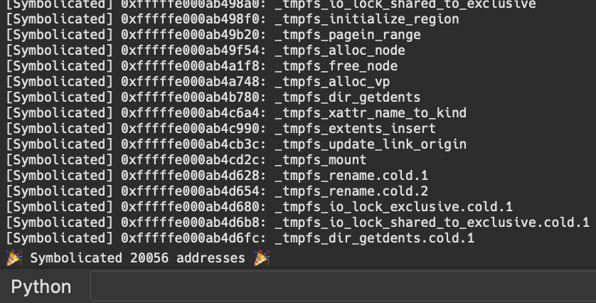

# symbolicator

> `ipsw` symbolication signatures

## What 🤔

This repo contain's `ipsw`'s symbolication signature files.

## How Good

Currently we are sitting at `63.85%` on **xnu** 

## Getting Started

Get the signatures

```bash
git clone https://github.com/blacktop/symbolicator.git
```

Symbolicate a kernelcache

```bash
ipsw kernel sym KC --json --signatures /path/to/symbolicator-repo/kernel
```

Install IDA Plugin

```bash
ida/plugins/install.sh
```

Now you can apply the symbols to you kernelcache in IDA by pressing `Alt+F8`



## Plugins

Supported Plugins/Scripts

- [Binary Ninja](plugins/binja)
- [Ghidra](plugins/ghidra)
- [IDA Pro](plugins/ida)

## Generate NEW signatures

You can set these ENV VARS to control the the outputed signature's metadata

- `TARGET` The target binary. (e.g. com.apple.driver.AppleMobileFileIntegrity)
- `MAX_VERSION` The maximum version of the target darwin.
- `MIN_VERSION` The minimum version of the target darwin.
- `JSON_FILE` The path to the JSON file. (e.g. /path/to/sig.json)

To generate signatures for `xnu`

```
ida/run.sh --kernel /path/to/KDK/kernel
```

To generate signatures for a `kext`

```
ida/run.sh --kext /path/to/KDK/kext
```

## TODO

- [ ] add support for global variables/constants
- [ ] byte pattern matching
- [ ] use arg count to assist in identifying anchor caller (as arg position/register)

## Credit

Idea was originally inspired by Jonathan Levin's [disarm](https://newosxbook.com/tools/disarm.html) 'matchers' file.

## License

MIT Copyright (c) 2024 blacktop