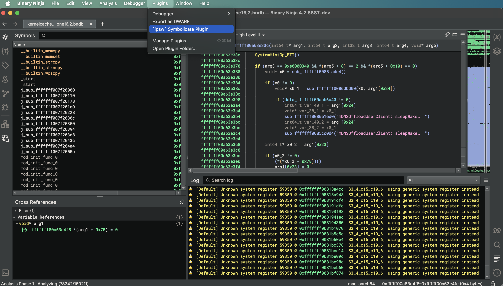
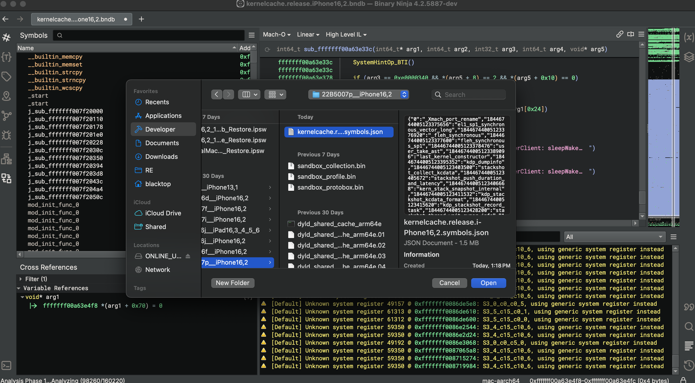
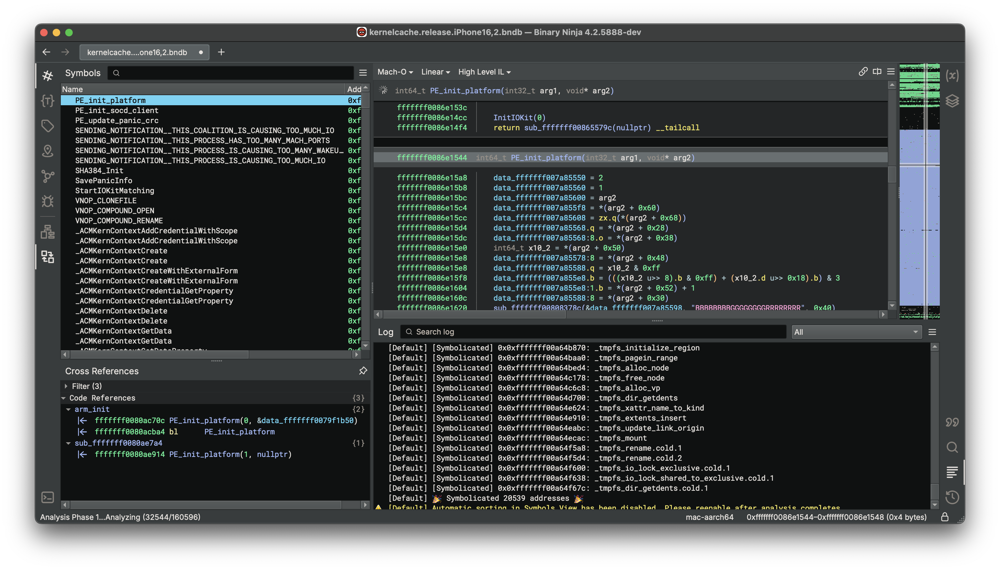

# Symbolicate Plugin

Author: **blacktop**

_Imports `ipsw` **symbols.json** files into Project creating functions (if they don't exist) and adding symbols._

## Description:

This plugin accompanies the [symbolicator](https://github.com/blacktop/symbolicator) repo and takes the `symbols.json` output of running `ipsw kernel symbolicate` and applies it to a kernelcache in Binary Ninja creating functions if they don't exist.

## Getting Started

### Install the plugin

On macOS

```bash
bash install.sh
```

### Run the plugin

Launch via `Plugin` drop down:



Pick your `symbols.json` file:



So many symbols 😍



Happy reversing!

## License

MIT Copyright (c) 2024 blacktop.