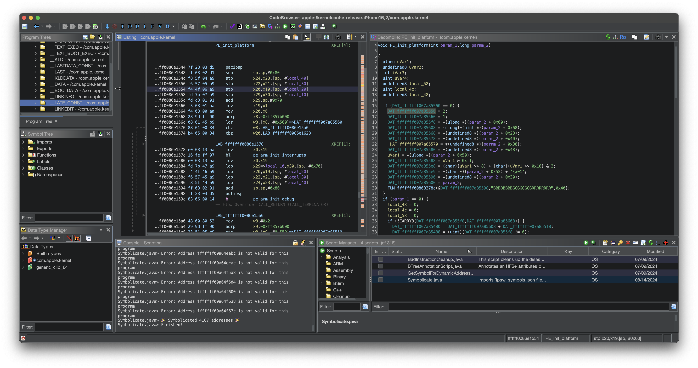

# Symbolicate Script

## Getting Started

### Install the plugin

```bash
bash install.sh
```

### Run the plugin

Launch via `Script Manager`:



> [!NOTE]  
> There is only `4167` **symbols** found because I only loaded/analyzed the `com.apple.kernel` fileset entry.

Happy reversing!

## License

MIT Copyright (c) 2024 blacktop.