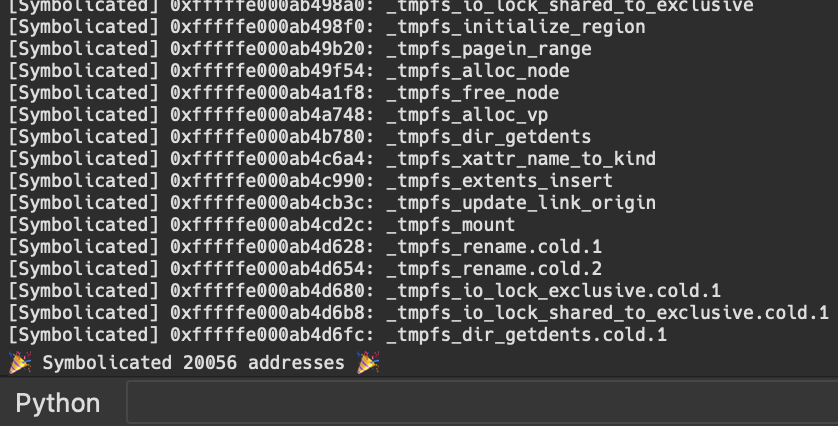

# Symbolicate Plugin

## Getting Started

### Install the plugin

```bash
bash install.sh
```

This will move the plugin into your `~/.idapro/plugins/` folder.  

The next time you start IDA Pro the plugin will register itself.

### Run the plugin

- Press: `Alt + F8`

This will open a file dialog allowing you to select the **JSON** file to add all the symbols to your **kernelcache**



Happy reversing!